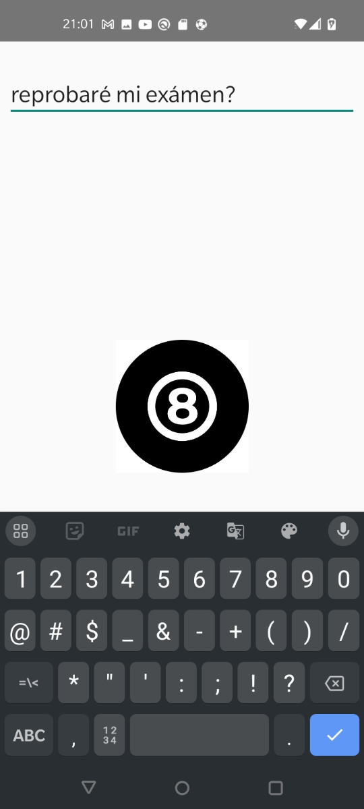
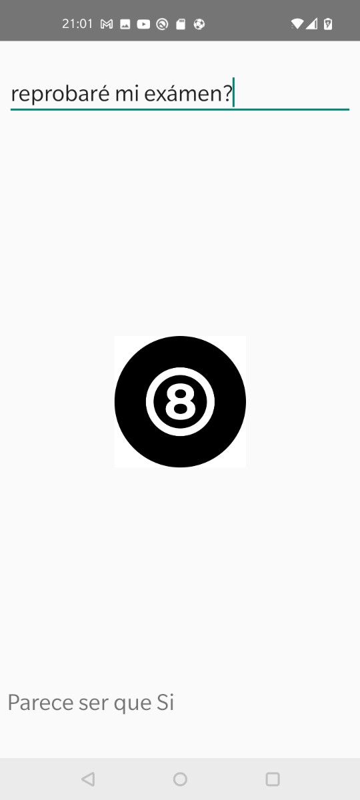

# Bola8Magica

Ejemplo sencillo de aplicacion que simula ser una bola 8 magica para responder a tus preguntas, estas deben ser preguntas que puedan ser respondidas por un si o un no

Al presionar la bola ocho (Es un ImageButton) se desplegara la respuesta en la parte inferior, ocultando automaticamente el teclado

Icons made by <a href="https://www.flaticon.com/authors/freepik" title="Freepik">Freepik</a> 
from <a href="https://www.flaticon.com/" title="Flaticon"> www.flaticon.com</a>
